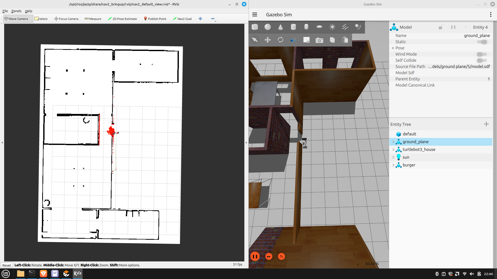

# Particle filter Package
This package contains the Particle filter Package.

## Installation

### Install ROS2 Jazzy
Follow the instructions to install ROS2 Jazzy for Ubuntu 24.04 at: https://docs.ros.org/en/jazzy/Installation.html#. Please install ros-jazzy-desktop version.

### Create a Catkin Workspace (if none exists)
Follow the instructions at: https://docs.ros.org/en/jazzy/Tutorials/Beginner-Client-Libraries/Creating-A-Workspace/Creating-A-Workspace.html
```bash
mkdir -p ~/ros2_ws/src
cd ~/ros2_ws/
colcon build
```

### Install the Turtlebot3 Simulation Package (for the Gazebo Simulation Environment)
Carefully follow instructions at: https://emanual.robotis.com/docs/en/platform/turtlebot3/quick-start/ and install turtlebot3 simulation in the same workspace you created earlier

Make sure that you are able to clone and successfully compile `turtlebot3_simulations` as the gazebo world will come from this package. 


### Download and Install the CS 603 Particle Filter Repository
```bash
cd ~/ros2_ws/src
git clone https://gitlab.com/peng-lab/particle-filter-ros2.git
cd ~/ros2_ws
colcon build
```

## Running the Simulation

### Generate Map Using GMapping (SLAM)
To generate the map, you must launch the `cartographer.launch.py` file in the turtlebot3_cartographer package then move the triton robot around using the teleop file. For more information, you can refer to the turtlebot3_slam page (https://emanual.robotis.com/docs/en/platform/turtlebot3/slam_simulation/)

### Robot Teleoperation (important note)

In order for the robot to perform SLAM to generate the map, you may move the robot manually using the `teleop_keyboard` script in the `turtlebot3_teleop` package. 

On a separate terminal, run: 
```bash
export TURTLEBOT3_MODEL=burger
ros2 run turtlebot3_teleop teleop_keyboard
```

### Save the Map

After you have a complete map, save it using the `nav2_map_server` package:
```bash
ros2 run nav2_map_server map_saver_cli -f ~/map
```

### Generate the Metric Map and Likelihood Field

Once you have the map, you can use it to generate the metric map that will be used for the sensor model. You can implement your code directly in the file `scripts/generate_likelihood_field.py`. This script should generate a  metric map and/or likelihood field that you will use in your sensor model for the particle filtering. 


## Particle Filter

To run the particle filter simulation environment: 
```bash
cd ~/ros2_ws
source install/setup.bash
export TURTLEBOT3_MODEL=burger
ros2 launch particle-filter-ros2 particle_filter.launch
```

Gazebo and RViz will also automatically launch, as well as some helper nodes for the necessary TF transforms and robot odometry. To visualize the particles, you can add a `PoseArray` display to the RViz window to visualize the particles you generate. You can also visualize the position of the robot by adding a `Pose` or `Odometry` display to the RViz window. You can also visualize the map by adding a `Map` display to the RViz window. Search the RViz documentation to learn more about `PoseArray`, `Map`, and `Odometry`. 

# Displaying map on RVIZ

To display map on the rviz, the map server needs to be started on a seperate terminal

```bash
ros2 run nav2_map_server map_server --ros-args -p yaml_filename:=path_to_map_yaml_file
```

and move the map_server from unconfigured to configure and activate state. To do so, run the following commands on a seperate terminal

```bash
ros2 lifecycle set /map_server configure
ros2 lifecycle set /map_server activate
```

However, make sure that RVIZ is listening to /map topic before making the state transition on map_server.
The expected order of execution, therefore would be starting the map_server-> Setting up the map frame and listening to /map topic in RVIZ -> Making the transition to configure and activate on a seperate terminal.


You can implement your code for the particle filter directly in the file `scripts/particle_filter.py`. 




