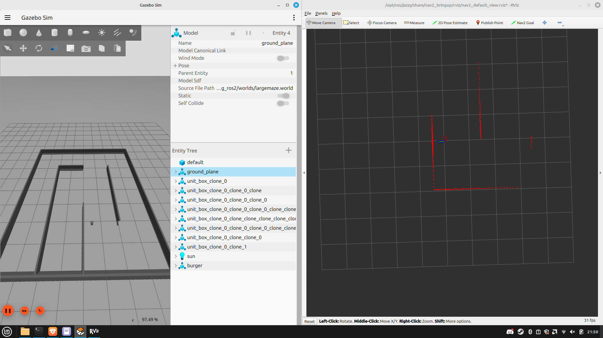

# Wall Following Simulation Package
This package contains the wall following robot simulation package. 

## Installation

### Install ROS2 Jazzy
Follow the instructions to install ROS2 Jazzy for Ubuntu 24.04 at: https://docs.ros.org/en/jazzy/Installation.html#. Please install ros-jazzy-desktop version.

### Create a Catkin Workspace (if none exists)
Follow the instructions at: https://docs.ros.org/en/jazzy/Tutorials/Beginner-Client-Libraries/Creating-A-Workspace/Creating-A-Workspace.html
```bash
mkdir -p ~/ros2_ws/src
cd ~/ros2_ws/
colcon build
```
### Install Other ROS Dependencies
Carefully follow instructions at: https://emanual.robotis.com/docs/en/platform/turtlebot3/quick-start/ and install turtlebot3 simulation in the same workspace you created earlier

### Download the Stingray Simulation Repository
```bash
cd ~/ros2_ws/src
git clone https://gitlab.com/peng-lab/wall_following.git
```

## Running the Simulation

```bash
cd ~/ros2_ws/
colcon build
source install/setup.bash
ros2 launch wall_following_ros2 wall_following.launch
```

You can implement your code for directly on the files `src/q_td_train.py`, `src/q_td_run.py`, `src/sarsa_train.py`, `src/sarsa_run.py`, and run them directly via `ros2 run wall_following_ros2 <python_filename>.py`. 

Gazebo and RViz will also automatically launch, as well as some helper nodes for the necessary TF transforms and robot odometry. 



### Optional Steps

This package uses the teleop provided by the `turtlebot3_teleop` package. Refer https://emanual.robotis.com/docs/en/platform/turtlebot3/slam/#save-map for how teleop is run.

